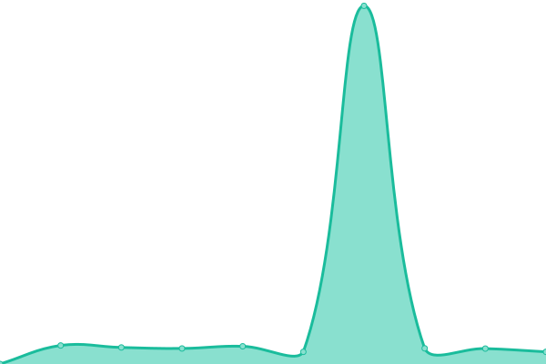
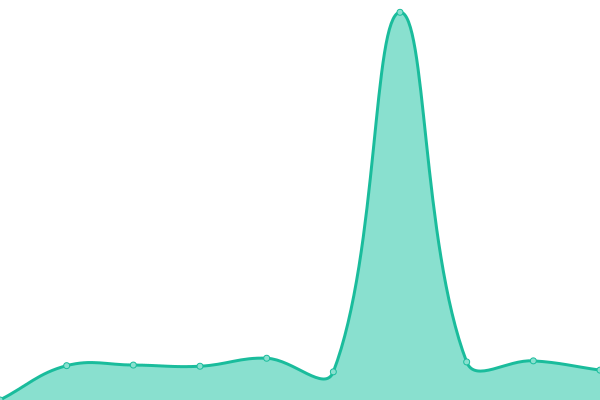

# [📈 Live Status](https://status.useorgx.com): <!--live status--> **🟩 All systems operational**

This repository contains the open-source uptime monitor and status page for [Hope Atina](hopeatina.github.io), powered by [Upptime](https://github.com/upptime/upptime).

With [Upptime](https://upptime.js.org), you can get your own unlimited and free uptime monitor and status page, powered entirely by a GitHub repository. We use [Issues](https://github.com/hopeatina/upptime/issues) as incident reports, [Actions](https://github.com/hopeatina/upptime/actions) as uptime monitors, and [Pages](https://status.useorgx.com) for the status page.

<!--start: status pages-->
<!-- This summary is generated by Upptime (https://github.com/upptime/upptime) -->
<!-- Do not edit this manually, your changes will be overwritten -->
<!-- prettier-ignore -->
| URL | Status | History | Response Time | Uptime |
| --- | ------ | ------- | ------------- | ------ |
|  [OrgX App](https://useorgx.com) | 🟩 Up | [org-x-app.yml](https://github.com/hopeatina/upptime/commits/HEAD/history/org-x-app.yml) | 

 781ms
     
 | 

<a href="https://status.useorgx.com/history/org-x-app">100.00%</a>
    

|  [OrgX API Health](https://useorgx.com/api/health) | 🟩 Up | [org-x-api-health.yml](https://github.com/hopeatina/upptime/commits/HEAD/history/org-x-api-health.yml) | 

 4429ms
     
 | 

<a href="https://status.useorgx.com/history/org-x-api-health">100.00%</a>
    

|  [OrgX MCP](https://mcp.useorgx.com/mcp) | 🟩 Up | [org-x-mcp.yml](https://github.com/hopeatina/upptime/commits/HEAD/history/org-x-mcp.yml) | 

 152ms
     
 | 

<a href="https://status.useorgx.com/history/org-x-mcp">100.00%</a>
    

|  [OrgX Staging](https://next.useorgx.com/api/health) | 🟩 Up | [org-x-staging.yml](https://github.com/hopeatina/upptime/commits/HEAD/history/org-x-staging.yml) | 

 1794ms
     
 | 

<a href="https://status.useorgx.com/history/org-x-staging">100.00%</a>
    

<!--end: status pages-->

[**Visit our status website →**](https://status.useorgx.com)

## 📄 License

- Powered by: [Upptime](https://github.com/upptime/upptime)
- Code: [MIT](./LICENSE) © [Anand Chowdhary](https://anandchowdhary.com), supported by [Pabio](https://pabio.com)
- Data in the `./history` directory: [Open Database License](https://opendatacommons.org/licenses/odbl/1-0/)
